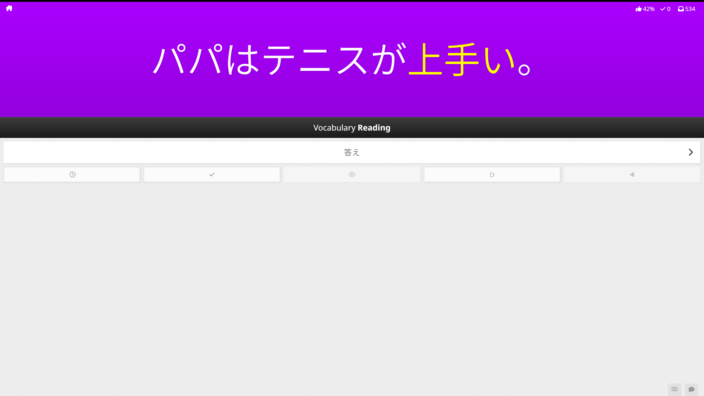

# WaniKani Vocabulary in Context

Replaces vocabulary in reviews with WaniKani context sentences.

## Install

1. Install TamperMonkey:

   - [Chrome](https://chromewebstore.google.com/detail/tampermonkey/dhdgffkkebhmkfjojejmpbldmpobfkfo)
   - [Firefox](https://addons.mozilla.org/en-US/firefox/addon/tampermonkey/)
   - [Opera](https://addons.opera.com/en/extensions/details/tampermonkey-beta/)

2. Install [WanKani Open Framework](https://community.wanikani.com/t/instructions-installing-wanikani-open-framework/28549).
3. Install the [Userscript](https://github.com/duffey/wanikani-vocabulary-in-context/raw/main/wanikani-vocabulary-in-context.user.js).